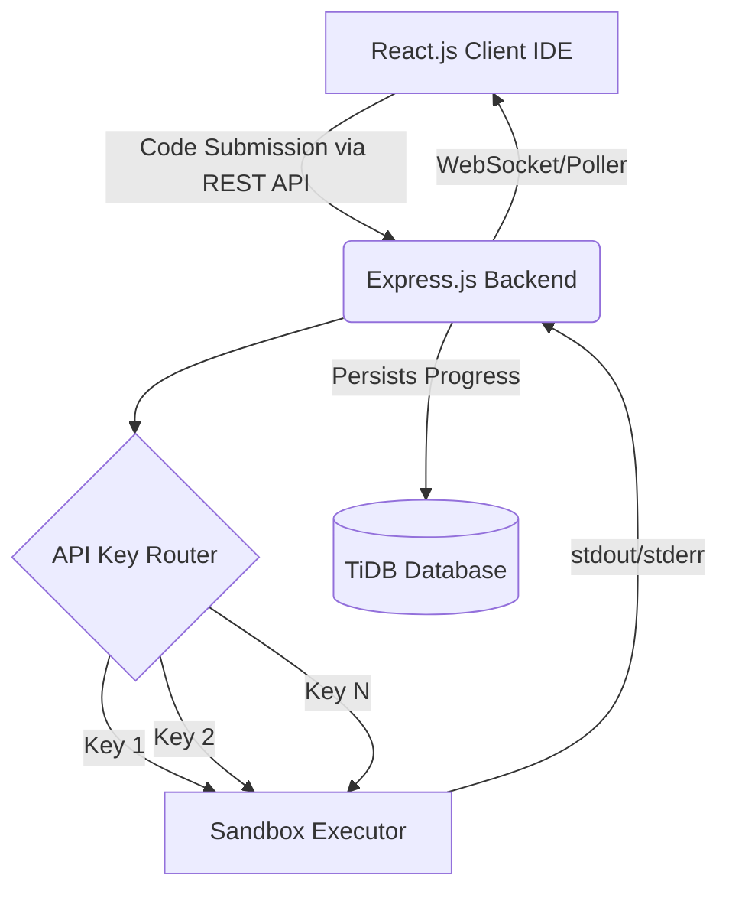

<div align="center">

# 🚀 QMAZE IDE v2.0 - Pattern Matching Engine


[](https://reactjs.org/)
[](https://nodejs.org/)
[](https://pingcap.com/)
[](https://opensource.org/licenses/MIT)

*An advanced, secure, and competitive coding environment designed for intense pattern-matching challenges.*

[Explore Features](#-core-features) • [Installation](#%EF%B8%8F-installation-guide) • [Architecture](#%EF%B8%8F-system-architecture) • [Security](#-anti-cheat-systems)

<p align="center">
  
</p>

</div>

---

## 🌟 Overview

**QMAZE IDE** is a sophisticated web-based compiler and pattern-matching evaluation platform. It provides a highly controlled environment where students can write, execute, and validate C and Java code against predefined patterns. Built to handle heavy concurrent loads during college coding events, the system ensures fairness, speed, and strict security monitoring.

<br>

## ✨ Core Features & Optimizations

We have implemented several enterprise-grade techniques to ensure zero downtime and lightning-fast execution, even when multiple users compile code simultaneously.

| Feature Area | Description | Impact |
| :--- | :--- | :--- |
| **⚡ Smart Execution Queue** | A robust queuing mechanism in Node.js that throttles intensive requests. It processes `C` and `Java` compilations chronologically. | Prevents server crashes and memory leaks during high concurrency. |
| **🛡️ Distributed Compute Engine** | Integrates with high-performance Tier-1 cloud execution instances to compile code swiftly and securely. | Sub-second execution times with strict containerized isolation. |
| **🔄 Intelligent API Rotation** | *Secret Key Rotation Logic:* The backend dynamically cycles through a pool of distinct execution access keys in a continuous loop. | Effectively bypasses standard rate limits, scaling execution quotas infinitely securely. |
| **⏱️ Dynamic Timeout Handling** | Hardcoded execution limits (e.g., 5-10s) to forcefully terminate infinite loops or heavy processing scripts. | Protects the compute engine resources and ensures fair play. |
| **⏳ Active Cooldowns** | Implements a 5-second `Run` button cooldown per user payload to prevent intentional DDoS or spamming. | Maintains queue stability and fair resource distribution. |

<br>

## 🔐 Advanced Anti-Cheat Systems

To maintain the integrity of competitive programming events, QMAZE enforces strict behavioral tracking:

- **🚫 Paste Protection:** Detects and prevents unauthorized pasting from external sources, logging a warning violation immediately.
- **👁️ Focus Monitoring (Window Blur):** Tracks system visibility. Switching tabs, opening new windows, or minimizing the IDE triggers a severe security alert and adds to the user's warning count.
- **⏱️ Master Timer Override:** Admin-controlled session timers are completely synced via backend. Users cannot manipulate the countdown using browser developer tools.

<br>

## ⚙️ System Architecture

<details>
<summary><b>Click to expand Technical Architecture Diagram</b></summary>
<br>


</details>

<br>

## 🛠️ Installation Guide

Follow these steps to set up the QMAZE IDE locally.

### 1. Clone the Repository
```bash
git clone https://github.com/Rishidevlx/Pattern-Matching-Application.git
cd Pattern-Matching-Application
```

### 2. Frontend Setup (React)
Open a new terminal and run:
```bash
# Install dependencies
npm install

# Start development server
npm run dev
```

### 3. Backend Setup (Node.js)
Open another terminal tab:
```bash
cd backend

# Install dependencies
npm install

# Create environment file (.env) and add necessary credentials
# (Database connection strings, Execution API Keys)

# Start backend server
node server.js
```

<br>

## 🎮 Admin Controls

The system includes a secure Admin Panel (`/admin`) capable of configuring global constraints instantly:
- Enable/Disable Focus and Paste Security globally without code deployment.
- Adjust global session durations.
- Live-monitor active sessions and execution status.

---

<div align="center">
  
  
  **Built with 💻 and ☕ by [Rishidevlx](https://github.com/Rishidevlx)**
</div>
